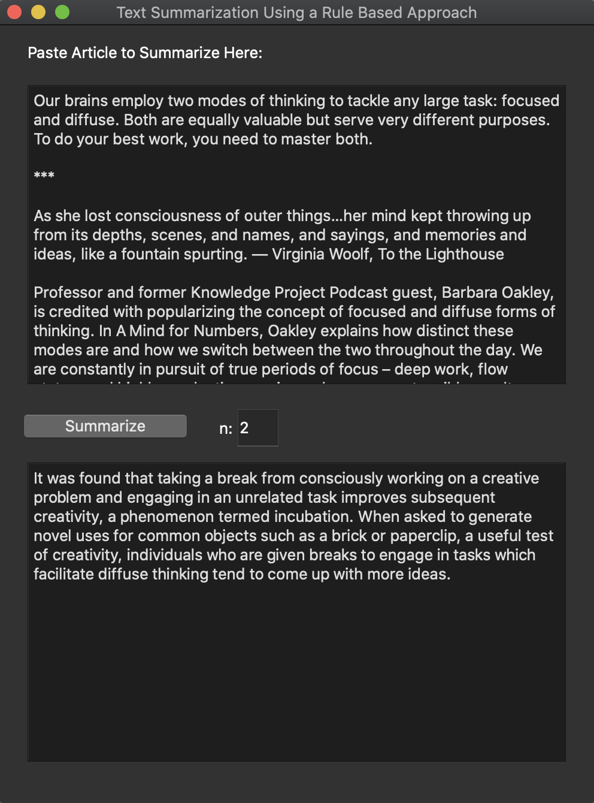

# Natural Language Processing

#1: 
_Auto Summarizing Text Using a Rule-Based Approach_
\
#2: _Sentiment Analysis using Machine Learning_

#### Auto Summarising Text:

* Retrieve input using a PyQt GUI (or optionally through a web scraping method using BeautifulSoup)
* Extract a list of words present in text
* Remove stop words and punctuation from list
* Create a frequency distribution of words
* Extract a separate list of sentences present in text
* Create a dictionary mapping sentence index to importance score
* Calculate each sentence's importance score by adding the frequency of each contained word
* Sort sentence indexes by importance
* Retreive and concatenate the 'n' most important sentences from their indexes
* Output in GUI

#### Machine Learning Sentiment Analysis:
* Step
